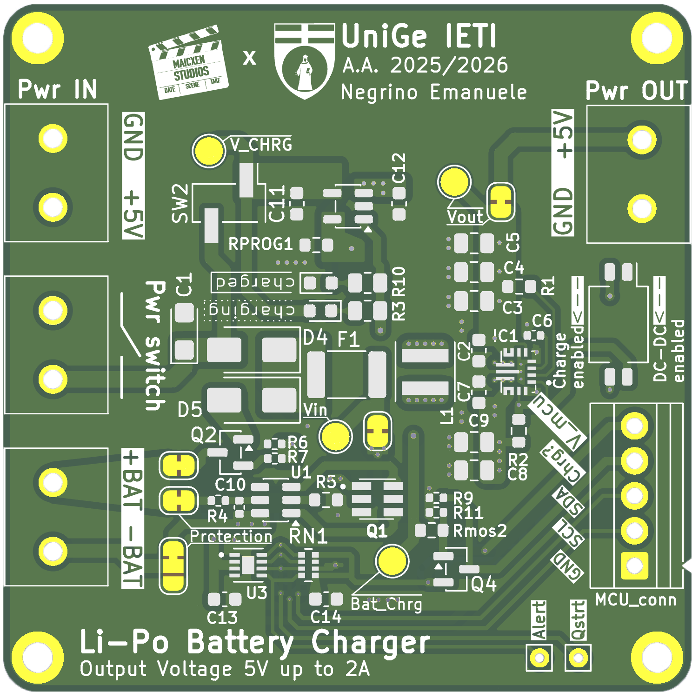
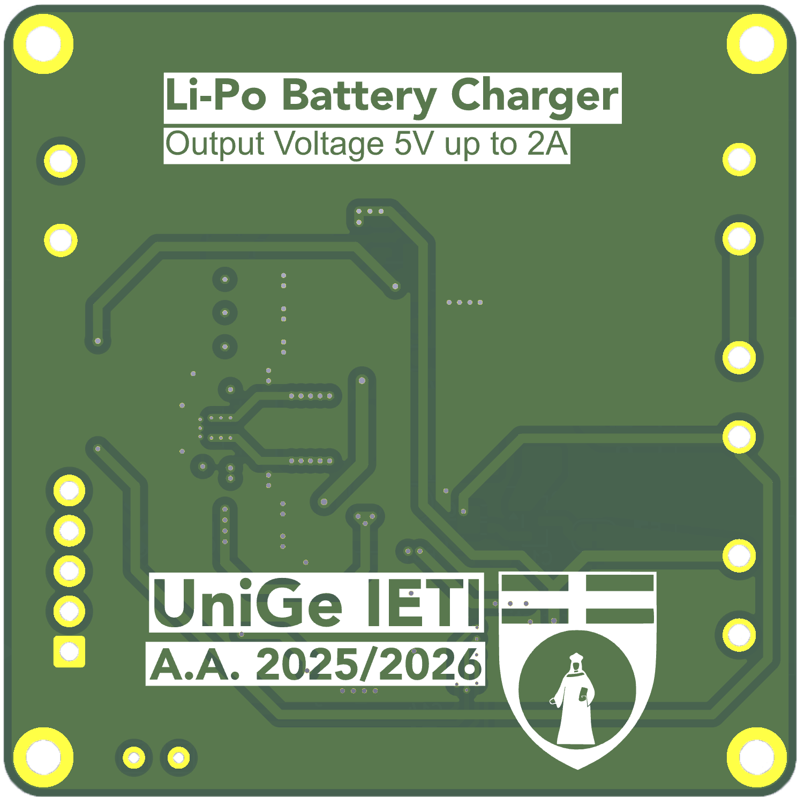

# Power Management Unit (PMU) per Sistemi Embedded


<div align="center">
  <!-- Sostituisci con i nomi reali dei file immagine esportati -->
  
  &nbsp;&nbsp;&nbsp;&nbsp;&nbsp;&nbsp;&nbsp;&nbsp;&nbsp;&nbsp;&nbsp;&nbsp;&nbsp;&nbsp;&nbsp;&nbsp;&nbsp;&nbsp;
  
</div>

<br>

Questo repository contiene tutti i file di progettazione hardware, le simulazioni e le librerie software per una **Power Management Unit (PMU) integrata**, sviluppata come progetto di Tesi di Laurea Triennale in Ingegneria Elettronica e Tecnologie dell'Informazione presso l'Università degli Studi di Genova.

Il modulo (dimensioni 50x50 mm su PCB a due strati) è progettato per superare il divario tecnologico tra le tensioni variabili delle batterie ai Polimeri di Litio (Li-Po) e le specifiche di alimentazione stabili a 5V richieste dai carichi digitali, garantendo continuità di servizio e sicurezza operativa.

---

## ✨ Caratteristiche Principali (Features)

* **Power Path Management:** Commutazione automatica e trasparente tra sorgente esterna (5V) e batteria, dando priorità all'alimentazione di rete senza azzerare i transitori sul carico.
* **Conversione DC-DC:** Uscita stabile a 5V tramite convertitore Buck-Boost, operante in modo trasparente indipendentemente dallo stato di carica della cella (da 3.0V a 4.2V).
* **Ricarica Li-Po 1S:** Algoritmo CC-CV integrato basato su architettura lineare, con interruzione automatica a 4.2V.
* **Protezione Hardware (BMS):** Modulo di protezione contro sovrascarica (< 2.4V), sovraccarica (> 4.3V) e cortocircuiti.
* **Fuel Gauging I²C:** Stima accurata dello Stato di Carica (SOC) e *alert* hardware tramite algoritmo ModelGauge, senza necessità di resistenze di shunt, azzerando la deriva dell'errore.

---

## 🛠 Architettura Hardware

Il progetto è stato interamente sviluppato utilizzando **KiCad 9.0**. Il sistema si basa sui seguenti circuiti integrati:

| Sottosistema | Modello IC | Produttore | Funzione Principale |
| :--- | :--- | :--- | :--- |
| **DC-DC Converter** | TPS630701 | Texas Instruments | Convertitore Buck-Boost 2.4 MHz fisso a 5V. |
| **Battery Charger** | MCP73831 | Microchip | Controller lineare per ricarica Li-Po 1S (CC-CV). |
| **Fuel Gauge** | MAX17048 | Maxim Integrated | Sensore SOC I²C con algoritmo ModelGauge. |
| **Protection (BMS)** | DW01A + FS8205 | HM Semi / IC Fortune | IC di protezione batteria e doppio MOSFET N-Channel. |
| **Power Path** | DMP1045U-7 | Diodes Inc. | MOSFET P-Channel per commutazione automatica. |

---

## 📊 Prestazioni e Risultati Sperimentali

Il circuito è stato collaudato strumentalmente, registrando ottimi risultati in termini di efficienza energetica e stabilità del segnale:

* **Efficienza Energetica ($\eta$):** Compresa tra il **78.3%** (a pieno carico, ~1.25A) e il **90%** (a carico ridotto, ~100mA).
* **Ripple di Tensione:** Estremamente contenuto, registrando un picco massimo di **60 mV** a 300 mA (90 kHz) e **40 mV** a 1.4 A (390 kHz).
* **Carico Elettrico Massimale:** Il sistema sostiene in sicurezza carichi continui fino a **1.3A a 4.92V** (circa 6.4W in uscita) prima dell'intervento del fusibile resettabile hardware (tarato per sgancio a 1.6A).

<div align="center">
  <!-- Aggiungi nella repo l'immagine dei grafici dell'oscilloscopio se lo desideri -->
  
  
</div>

---

## 💻 Libreria Software (Firmware)

A supporto dell'hardware, è stata sviluppata una libreria firmware in **C++** dedicata al sensore MAX17048. 
La libreria permette ai microcontrollori host (es. Arduino, ESP32, STM32) di interfacciarsi facilmente con la PMU per:
- Lettura in tempo reale della tensione della cella ($V_{cell}$) e del SOC (%).
- Monitoraggio del rateo di ricarica/scarica tramite registro `CRATE`.
- Gestione interrupt hardware sul pin `ALRT` per avvisi di sotto-tensione programmabili e sleep mode per il risparmio energetico.

---

## 📁 Struttura della Repository

```text
├── Hardware/
│   ├── Kicad_files/        # File di progetto sorgente (Schematici, Layout PCB)
│   ├── Production/         # File Gerber e Drill pronti per la produzione industriale
│   ├── Assembly/           # File BOM (Bill of Materials) e CPL per assemblaggio SMT Pick & Place
│   └── 3D_Models/          # Rendering 3D della scheda top/bottom (STEP/PNG)
├── Simulations/            # File di simulazione SPICE dei blocchi funzionali (Proteus 8)
├── Firmware/               # Libreria C++ custom per MAX17048 e sketch di test (Arduino)
├── Datasheets/             # PDF dei datasheet originali dei componenti utilizzati
├── Docs/                   # Immagini, grafici di test termici/ripple, schemi e documentazione extra
└── README.md
